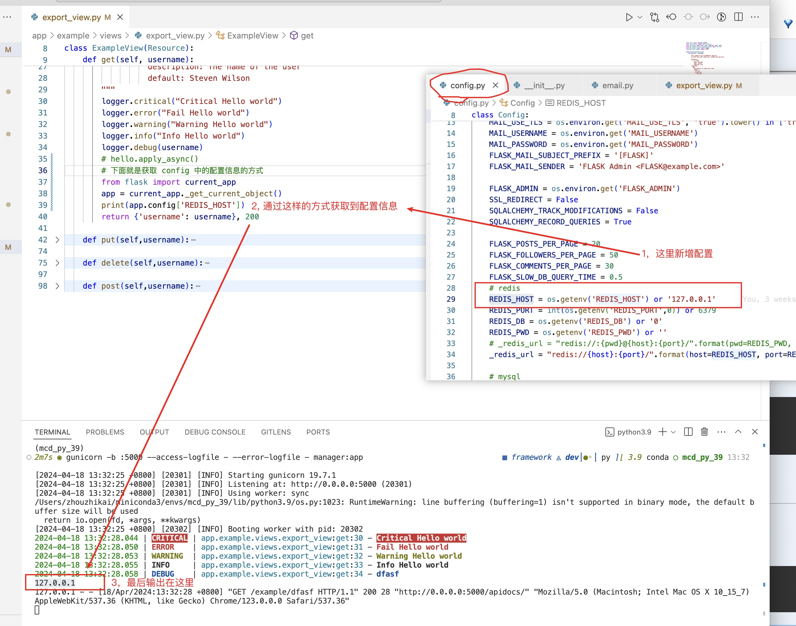

# 开发工具
- 数据库软件： [dbgate](https://dbgate.org/)
- redis软件:  [AnotherRedisDesktopManager](https://github.com/qishibo/AnotherRedisDesktopManager)
- 编码软件： [vscode](https://code.visualstudio.com/Download)
- Schema使用: [Schema使用](../app/example/schemas/README.md)
- 权限设计模块： [RBAC权限设计](RBAC.md)
- swagger: [接口文档](swagger.md)

# 环境构建
## 环境准备
- python==3.6+
- mysql==5.7 or 【本地模式 sqlite3】
  - 当USE_SQLLITE 变量设置为 Flase 时，会启用mysql配置
  
- redis==6.2.6
- 使用的技术包请参考: requirements/dev.txt 

## 依赖安装
```
pip install -r requirements/dev.txt
``` 

# 本地开发
- 开发模式
```
export FLASK_APP=manager.py
export FLASK_CONFIG=development
# dubug 模式
export FLASK_DEBUG=1
```
- 生成模式
```
export FLASK_CONFIG=production
```
- 运行服务
```
flask run
```
# celery 服务
- 启动定时触发器
```
celery -A app.tasks beat --loglevel INFO
```

- 启动任务执行器
```
celery -A app.tasks worker --loglevel INFO
```

# 部署配置
```
gunicorn -b :5000 --access-logfile - --error-logfile - manager:app
```

# 临时调试
```
flask shell
```

# 数据库表结构版本管理
## 常规使用
1.运行这个命令之后会产生一个migrations文件夹(!!!仅初始化的时候使用!!!)
```
flask db init
```

2.运行这个命令之后会在migrations文件夹的versions里面产生一个版本的py文件
```
flask db migrate -m"版本名(注释)"
flask db migrate # 也可以不加注释
```

3.然后观察表结构
- 这一步就是执行的问题了，运行这个执行变更
```
flask db upgrade
```

## 若返回版本,则利用 
- 查看版本号
```
flask db history  
```
- 版本号
```
flask db downgrade(upgrade) 
```

## 注意事项
- 数据库版本变更中需要删除字段使用下列操作
- 备注： 风险较高，不建议采用
```migrations/env.py 
render_as_batch=True, # 仅测试环境开启
```
- 生成树目录
```
# 过滤包含所有的 .js 文件和 .css 文件
tree -I '*.sqlite' -I '*.pyc' -I '__pycache__' -I '*.log'
```
# 单元测试
- 运行单元测试
flask test
- 代码覆盖率
flask test --coverage 

# 开发注意事项
